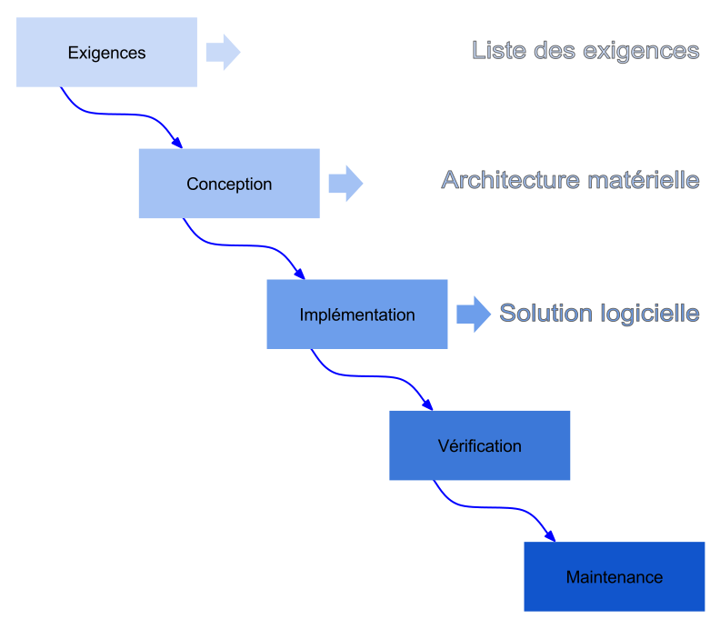

# Premier cours

7 Septembre 2020 (10h)

## Informations utiles

### Professeurs

- HAMRI Maamar El Amine, [amine.hamri@univ-amu.fr](mailto:amine.hamri@univ-amu.fr)
- MASSAT Jean luc, [jean-luc.massat@univ-amu.fr](mailto:jean-luc.massat@univ-amu.fr)
- YACOUB Aznam, pas de mail donné 

### Volume horaire

- 9 cours de 2h
- 9 TD de 2h
- 9 TP de 2h

### Modalités de contrôle des connaissances

Première session:
$NoteFinale = 0.6 * ExamenTerminal + 0.4 * Projet$

Avec $Proj = \max(0.3 * Projet1 + 0.7 * Projet2, Projet2)$

L'examen terminal sera en décembre et durera 3H.

Les deux projets se dérouleront sur environ 3 et 7 semaines.

### Projets

Les projets sont de taille conséquente, il est donc conseillé de former des équipes de 5. Les changements d'équipe seront impossible après le début des projets.

Il est à priori possible de se mettre en équipe avec des étudiants d'autres groupes, mais à condition que l'EDT soit bon (il faudra demander au professeur).

## Présentation générale

### Plan du cours

- Intéret d'adopter un cycle de vie
- Présentation d'une méthode de developpement logiciel
- Présenter comment coder, organiser le code, intérêt des test, ...

Le génie logiciel étudie des méthode et outils qui permettent de déveloper des logiciels de taille conséquente en gardant une qualité élevée, et une maitrise des coûts de developpement et des délais. Cette science ne se concentre pas sur le code, mais sur des solutions qui vont faciliter l'implémentation.

### Constat

Pour beaucoup de projets informatiques :

- le produit ne répond pas au cahier des charges.
- le produit est livré hors délai.
- lors de la maintenance, des erreurs se manifestent à cause d'une mauvaise hygiène de code.

L'objectif est de construire des logiciels ergonomiques, fiables, évolutifs & économiquement viables.

### Indicateurs utiles sur un projet

 - *Volume* : le nombre d'instruction (en KLS, Kilo Lignes Sources?)
 - *Effort* : le temps nécessaire pour un ingénieur (en HA -> Hommes par Année)
 - *Délai de réalisation*
 - *Durée de vie*

### La qualité logicielle

Un logiciel peut être observé selon ses qualités, qui sont :

- soit internes, comme la modularité, la maintenabilité, ...
- soit externes, comme la validité, la robustesse, la performance, ...

Durant le développement, on va principalement voir les qualités internes.

Les facteurs de qualité ne sont pas nécessairement compatibles 2 à 2, il faut souvent trouver un compromis.

## Méthode et méthodologie

Une méthode est un semble de règles qui consuisent à une solution.
Une méthodologie est une agrégation de méthodes, guides, outils, techniques de différents domaines permettant de déduire la manière de résoudre un problème.

## Modèles et modélisation

La modélisation est une activité qui précède toute décision ou formulation.

Un modèle est une vue partielle plus ou moins abstraite de l'existant.
Un modèle est une interprétation de la compréhenstion d'une situation ou d'une idée de la situation.

### Qualité des modèles

Un modèle doit présenter les qualités suivantes:
- abstraction: éviter de faire référence aux détails de toutes les sous parties
- raffinement: un sous-ensemble du modèle soit pouvoir être décrit à l'aide d'un autre modèle
- lisibilité: le modèle doit être ismple à interpréter

Il existe différents types de modèles:

- iconiques
- analogiques
- analytiques
- conceptuels

Il faut ainsi choisir un modèle adapté selon ce que l'on décrit :

- pour des données, on peut utiliser la méthode JSP, ou le modèle Entité-Relation
- pour des fontcions, on peut utiliser un diagramme hiérarchique
- pour le comportant, on peut utiliser du pseudo code, un modèle mathématique, ...

## Modèle de développement : le cycle de vie

[Voir l'article sur wikipedia](https://fr.wikipedia.org/wiki/Cycle_de_d%C3%A9veloppement_(logiciel))

La gestion de projet nécessite la modélisation du processus de developpement lui-mème. C'est ce à quoi le cycle de vie sert.

Il faut savoir que ce modèle n'est pas unique, et que d'autres modèles existent comme par exemple la méthode agile, ou la méthode merise. Ces méthodes peuvent être plus adaptées à certains types de logiciels.

Plusieurs modèles de cycle de vie ont été élaborés. Tous ont en commun au minimum les 5 phases essentielles de tout développement :

- la spécification (cahier des charges)
- la conception
- la réalisation
- les test
- l'exploitation

### Le modèle de la cascade

Ce modèle est inspiré de l'industrie du batiment, et repose sur les principes suivants :

- on ne peut pas construire la toiture avant les fondations
- les conséquences d'une modification en amont du cycle ont un impact majeur sur les coûts en aval 

Ainsi, dans ce modèle, les taches sont executées séquentiellement, et en conséquent les erreurs sont détectées tardivement (lors de la livraison du produit) et le processus pour les fixer sera donc long et coûteux.

#/media/Fichier:Mod%C3%A8le_en_cascde.svg)

### Le modèle en V

Ce modèle, qui est encore aujourd'hui très utilisé, a été proposé pour combler les lacunes du modèle en cascade, c'est à dire (principalement) la tardiveté de la détection des erreurs.

Pour cela, il définit des tests qui permettent de tester les composants indépendaments. en effet, chaque phase de développement est associée avec la phase de validation qui lui correspond.

#/media/Fichier:Cycle_de_developpement_en_v.svg)

Note : la "recette" correspond à des test d'acceptation.

Note : C'est le modèle que l'on va adopter pour le premier projet.

### Le modèle en spirale

Cette méthode reprend les différentes étapes du cycle en V. Elle est liée aux projets innovants où il est difficile de cerner les besoins du client.

Elle permet ainsi de pouvoir changer le cahier des charges plusieurs fois, ce qui serait impossible avec un modèle en spirale.

.svg)

